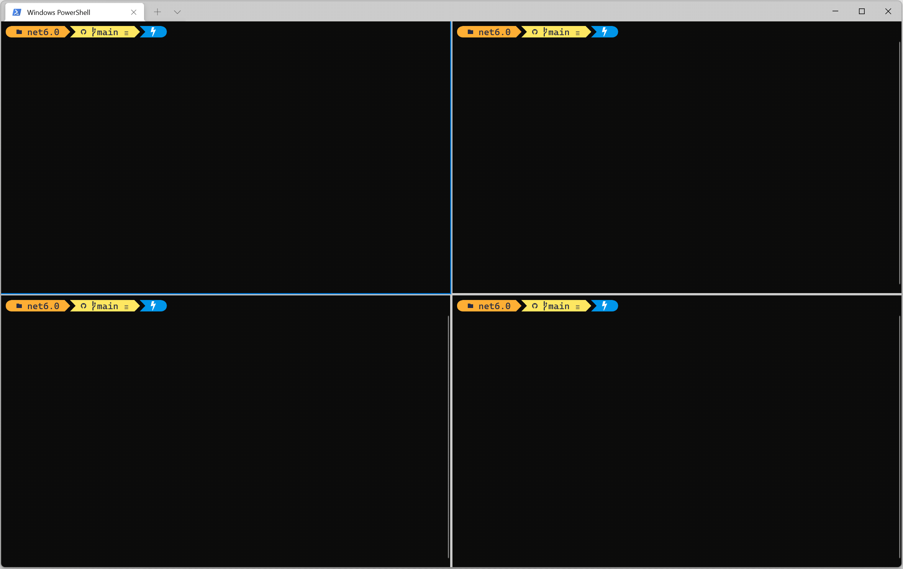

# PubSub Demo using .NET 6



## Description

This is a console application that demonstrates how [Ably](https://ably.com) can be used for PubSub messaging.

## Tech stack

The project uses the following components:

- [.NET 6](https://dotnet.microsoft.com/download/dotnet/6.0), .NET 6 SDK.
- [Spectre.Console](https://spectreconsole.net/), a library to make beautiful console applications.
- [Ably](https://ably.com/), for realtime messaging at scale.

## Building & running locally

### Prerequisites

1. Install the [.NET 6 SDK](https://dotnet.microsoft.com/download/dotnet/6.0) .
2. [Sign up](https://ably.com/signup) or [log in](https://ably.com/login) to ably.com, and [create a new app and copy the API key](https://faqs.ably.com/setting-up-and-managing-api-keys).
3. Clone this repository to your local machine.

### Building the project

1. Build the console app by running `dotnet build` in the `src\ConsoleChat` folder.
   > The executable is located in the `src\ConsoleChat\bin\Debug\net6.0` folder.
2. Start one instance of the application in the publisher mode:

    ```powershell
    .\ConsoleChat.exe pub <ChannelName> <AblyApiKey>
    ```

3. Start one instance of the application in the subscriber mode:

    ```powershell
    .\ConsoleChat.exe sub <ChannelName> <AblyApiKey>
    ```

Alternatively, you can start the application in Debug mode in VSCode. The `launch.json` contains input arguments and this instructs VSCode to show input fields when the application is run:


## Contributing

Want to help contributing to this project? Have a look at our [contributing guide](CONTRIBUTING.md)!

## More info

You want more information about this sample or using .NET & Ably in general? Feel free to contact me via Twitter [@marcduiker](https://twitter.com/marcduiker).

- [Ably on Twitter](https://twitter.com/ablyrealtime)
- [Ably SDKs](https://github.com/ably/)
- [Ably.com](https://ably.com)

---
