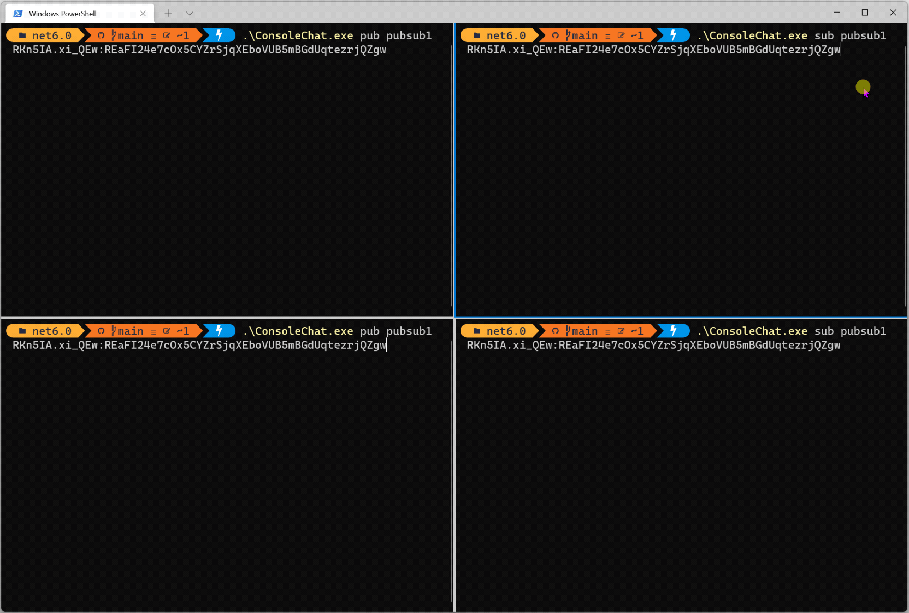

# Pub/Sub Demo using .NET 6



## Description

This is a .NET 6 console application that demonstrates how [Ably](https://ably.com) can be used for pub/sub messaging.

## Tech stack

The project uses the following components:

- [.NET 6](https://dotnet.microsoft.com/download/dotnet/6.0), .NET 6 SDK.
- [Spectre.Console](https://spectreconsole.net/), a library to make beautiful console applications.
- [Ably](https://ably.com/), for real-time messaging at scale.

## Building & running locally

### Prerequisites

1. Install the [.NET 6 SDK](https://dotnet.microsoft.com/download/dotnet/6.0) .
2. [Sign up](https://ably.com/signup) or [log in](https://ably.com/login) to ably.com, and [create a new app and copy the API key](https://faqs.ably.com/setting-up-and-managing-api-keys).
3. Clone this repository to your local machine.

### Building & running the project

1. Build the console app by running `dotnet build` in the `src\ConsoleChat` folder.
   > The executable is located in the `src\ConsoleChat\bin\Debug\net6.0` folder.
2. Start one instance of the application in the publisher mode:

    ```powershell
    .\ConsoleChat.exe pub <ChannelName> <AblyApiKey>
    ```

    > Ably will create a new channel if it doesn't yet exist.

3. Start one instance of the application in the subscriber mode:

    ```powershell
    .\ConsoleChat.exe sub <ChannelName> <AblyApiKey>
    ```

    > Use the same channel & API key as in step 2.

Alternatively, you can start the application in Debug mode in VSCode by pressing `F5`. The `launch.json` contains input arguments and this instructs VSCode to show input fields when the application is run in debug mode:


### Publishing the application

In case you want to publish and distribute this console app to use this with your co-workers or friends, you need to do the following:

1. Ensure you're in the folder where the *csproj* file is located.
2. Run the [`dotnet publish`](https://docs.microsoft.com/en-us/dotnet/core/tools/dotnet-publish) command:

    ```shell
    dotnet publish -c Release -r <RUNTIME_IDENTFIER> --self-contained=false /p:PublishSingleFile=true
    ```

    Example for windows x64 machines:

    ```shell
    dotnet publish -c Release -r win-x64 --self-contained=false /p:PublishSingleFile=true
    ```

    For more information on the available runtime identifiers, see the [.NET RID Catalog](https://docs.microsoft.com/dotnet/core/rid-catalog).

3. The release version of the application is now available in the `src\ConsoleChat\bin\Release\net6.0\<RUNTIME_IDENTIFIER>\publish` folder.

## Contributing

Want to help contributing to this project? Have a look at our [contributing guide](CONTRIBUTING.md)!

## More info

You want more information about this sample or using .NET & Ably in general? Feel free to contact me via Twitter [@marcduiker](https://twitter.com/marcduiker).

- [Join our Discord server](https://discord.gg/q89gDHZcBK)
- [Follow us on Twitter](https://twitter.com/ablyrealtime)
- [Use our SDKs](https://github.com/ably/)
- [Visit our website](https://ably.com)

---
[](https://ably.com)